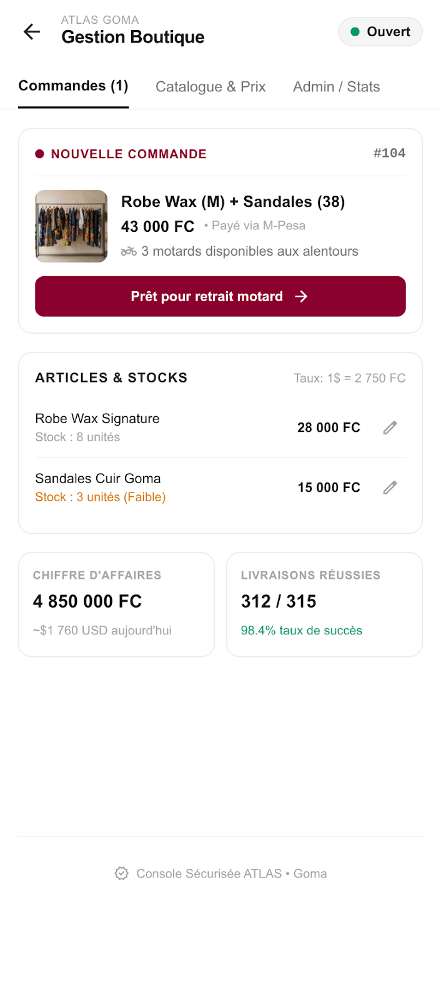

<div align="center">
  

  # ATLAS Merchant App (Vendeurs)
  **Le portail de gestion pour les boutiques partenaires d'ATLAS à Goma.**

  [](https://flutter.dev)
  [](https://dart.dev)
  []()
  []()
</div>

---

## 📌 À propos

**ATLAS Merchant App** est l'application (et web app) dédiée aux gérants de boutiques partenaires à Goma. Elle leur permet de suivre en temps réel les commandes entrantes, de mettre à jour leur catalogue produit, et d'analyser leurs revenus de manière centralisée.

## ✨ Fonctionnalités Clés

*   🔔 **Commandes Entrantes** : Alertes instantanées pour les nouvelles commandes payées (via KPay/M-Pesa) et appel automatisé d'un motard ATLAS.
*   📦 **Gestion des Stocks** : Mise à jour rapide des prix (en FC) et de la quantité d'articles disponibles.
*   📊 **Analytiques & Gains** : Suivi du chiffre d'affaires, des taux de réussite de livraison et des paiements reçus.
*   🚦 **Statut Boutique** : Mode "Ouvert" ou "Fermé" pour activer/désactiver temporairement la visibilité sur l'App Client.

---

## 📸 Capture d'Écran (UI/UX)

Un tableau de bord épuré, pensé pour l'efficacité opérationnelle.

<div align="center">
  
</div>

---

## 🛠️ Stack Technique

*   **Framework** : [Flutter](https://flutter.dev) (Dart)
*   **Architecture** : MVC / Clean Architecture
*   **Design System** : Pro, structuré et contrasté.
*   **Polices** : `Inter` (lisibilité) & `Plus Jakarta Sans` (titres).

## 🚀 Installation & Démarrage

1.  **Prérequis** : Avoir installé [Flutter](https://docs.flutter.dev/get-started/install).
2.  **Cloner le dépôt** :
    ```bash
    git clone https://github.com/atheon006/atlas-merchant-app.git
    cd atlas-merchant-app
    ```
3.  **Installer les dépendances** :
    ```bash
    flutter pub get
    ```
4.  **Lancer l'application** :
    ```bash
    flutter run
    ```

---

<div align="center">
  <p>Conçu pour booster le commerce local à Goma avec ❤️</p>
</div>
